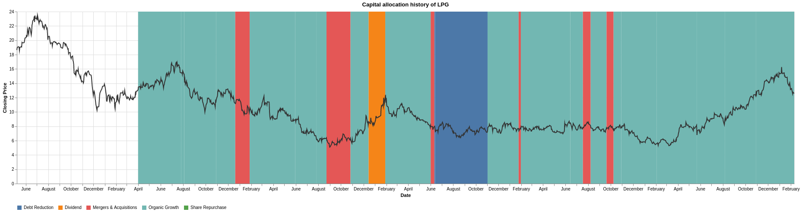

# Fortune (corp-capital-allocation) - Monitoring capital allocation of public companies
Fortune monitors SEC filings of public companies to signal changes in corporate capital allocation. 
Capital allocation is how a firm chooses to spend the money that it earns. 
There are only 5 distinct category of spending:
1. Organic Growth - Reinvest back into the company
2. Mergers and Acquisitions - Buy another company or assets
3. Share Repurchase
4. Dividends
5. Debt Reduction

Capital allocation decisions are made only at the highest level of management. 
Changes usually signal either financial stress or new found freedom.
However detecting the signal requires natural language processing. 
Fortune reads the text of the filings and creates a timeline of capital allocation decisions.  
This is the project that I complete during at Insight Data Engineering program (New York, Winter 2019).
Try it out at https://dataengine.xyz/ or watch it [here](https://youtu.be/H0jC8emyckI).

The ideal output of the system is the manually annotated chart below. 
There are 3 distinct capital allocation periods for Dorian LPG. 
Each of the periods with a clearly visible difference in trend and volatility in the stock price.

The machine annotated version still needs work but overall the framework is there to do NLP at scale. 
The machine did pick up the hostile take over bid from BW LPG during the summer of 2018. 
Also management's concern that it would happen in 2016 and 2017.
  

## Ingestion - Turn raw filings into individual sentences index in Elasticsearch

The edgar_loader.py in ingestion handles downloading the files from SEC Edgar and saving it to S3 to feed the pipeline.

The entire processing pipeline is implemented using Pulsar topics. 
This is a message driven system where each part can be dynamically scaled up or down based on load.
Within the pulsar folder there are 3 sub-folders:
1. pub - Source of messages that trigger the start of data processing
2. transformer - Workers that transform messages
3. sink - Workers that save results into Elasticsearch

There are 3 distinct stages to my pipeline. The first is turning raw filings into indexed sentences. 
This is handled by req_extract_text_of_filing.py (pub) and extract_text.py (sink). 
The second stage of transforming sentences into a timeline is handled by
1. corp_cmd.py publishing to *search_filings-8-K* topic
2. search_filings.py transforms the request into search hits relevant to each capital allocation category
3. classify_sentence.py transforms the search results into one of the 5 capital allocation states
4. corp_alloc_event.py saves down each classification into Elasticsearch

The final stage is trigger by using corp_cmd.py but publishing to *create-timeline* topic and
create_timeline.py processing the raw classification into time periods. 

## Installation

There isn't a one size fit all deployment. The following is how I deployed the system while at Insight

1. 3 EC2 machines with both Pulsar and Elasticsearch installed. The default is to use private static ips of 
10.0.0.11, 10.0.0.12, 10.0.0.13 but you can override it with command line args
2. The pipeline EC2 usage varied from 1 to 7 machines depending my load at the time

Here are the prerequisites

1. Train your own [Spacy](https://spacy.io/) classifier and name it corp_alloc_bal which the sentence_classifier.py loads
2. I use stock quotes from [IEX Cloud](https://iexcloud.io/)
3. Use [Anaconda](https://www.anaconda.com/distribution/) to setup the virtual env on your EC2 machines.
The actual env requirement varies by which component of the pipeline you want to run on which machine.
The NLP classification is memory intensive.
4. Use pulsar/process_governer.py for self healing. Worker processes do crash but the governer restarts them. 
Unacked messages get replayed so you continue where you left off.
